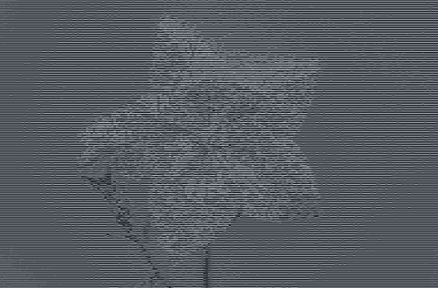

# img2ascii

This is a simple project written recreational purposes. It converts an image to ASCII text. It's made in Rust.

It works by iterating over the pixels of a given image, calculating the brightness value for each pixel's RGB color and mapping this value to a character in a string of available ASCII characters.

## Usage

Build with `cargo build` or preferrably `cargo build --release`.

`img2ascii <FILE_NAME> [SHRINK_FACTOR]`

The file name is required. The shrink factor is how much to shrink the original image by (the default is currently 5).
